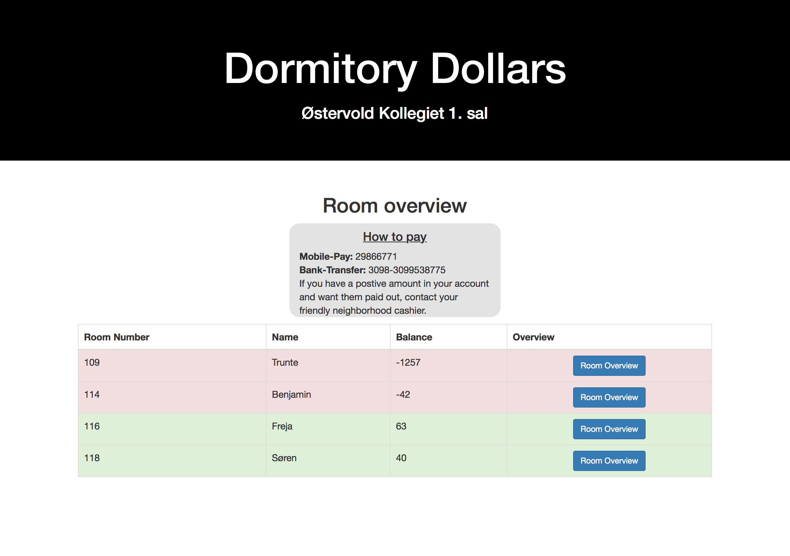

# Cashier system
A system to assist the cashier at a dormitory. It keeps track of transactions
and presents them in a web interface.

---

### How it works.
In the admin interface you can enter the rooms in the dormitory and the contact
info of the person living there. The admin interface can also be used to enter
transactions.
A summery of all rooms and transactions is then presented on the main page and
the transactions for a specific room can be seen on their overview page.

### Setup
#### Local installation
The system is coded in [django](https://www.djangoproject.com) and is setup
such that it can be easily deployed on a [Heroku server](https://www.heroku.com).

To get a local version up and running perform the following steps.

* Install a version of _python 3_ (The server is set to python `3.6.1`).
* Clone this repo and open a terminal in the same folder.
* Create a virtual environment and install the dependencies with the
following commands
```bash
$ pip install virtualenv
$ virtualenv -p `which python3` virtualenv
$ source virtualenv/bin/activate
$ pip install -r requirements.txt
```
* The next step is to create the database with these commands
```bash
$ ./manage.py migrate
$ ./maange.py createsuperuser
$ ./manage.py runserver
```

#### Heroku deployment
Once you have made an account on [Heroku](https://www.heroku.com) you can run
the following commands.
```bash
 $ heroku login
 $ heroku create # This step gives you a URL for the instance
 $ git push heroku master
 $ heroku run python manage.py migrate
 $ heroku run python manage.py createsuperuser
```
You can now visit the URL shown in step two and login at `something.heroku.com/admin`


### Contributing
Pull requests are more than welcome, bonus point if the code conforms to
`pylint`.
